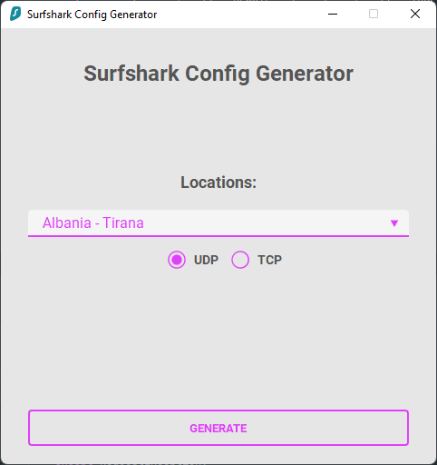

## Surfshark config generator
### A Python app with [PySide6](https://pypi.org/project/PySide6/) and [qt-material](https://pypi.org/project/qt-material/) stylesheet

## Screenshot

## How to set up
1. Clone the repository `git clone https://github.com/iAliF/Surfshark`
1. Create a virtual environment `virtualenv venv`
1. Activate the virtual environment
1. Install requirements using `pip install -r requirements.txt`

## Usage
- Run the app using `python main.py`
